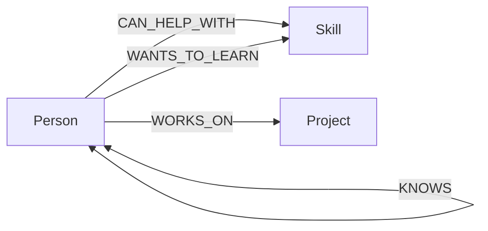

# Signal Atlas


Signal Atlas is a relationship intelligence workspace for communities building meaningful work. It surfaces warm introductions based on what people want to learn, who can help, their trusted relationship paths, and the projects that connect them.

## Why a graph database?

The core product question is not “which people have a skill?” but “who can help this person through the most trusted, shortest relationship path - and what projects are bridged by that path?” In a relational model this becomes a fragile chain of self-joins with an arbitrary depth. In CognoDB, people, skills, and projects are nodes; the meaningful links are typed relationships. Variable-length paths express the query directly and make new relationships useful without a schema migration.


## Data model



## Queries demonstrated

- `introductionsFor`: Person -> desired Skill <- mentor, with an optional 1–3 hop `KNOWS` traversal to rank the warmest path. The API also returns the exact node path, which the UI renders on demand as an explainable recommendation.
- `projectBridges`: Project <- contributor - `KNOWS*1..2` -> bridge person -> Project, uncovering cross-project paths that are awkward in relational SQL.
- `searchPeople`: parameterized search over people and skills.

All queries live in [queries.js](./queries.js) and use parameters through the official Neo4j JavaScript driver - no string-concatenated Cypher.


## Run locally

1. Install dependencies: `npm install`
2. Copy `.env.example` to `.env` and enter the CognoDB Cloud connection values.
3. Create a free c0 instance at [CognoDB Cloud](https://console.cognodb.com/signup). Use its `bolt+s://...` URI, username `cognodb`, and generated password.
4. Seed the graph: `npm run seed`
5. Start: `npm run dev`, then open `http://localhost:3000`.

Without environment variables the UI intentionally runs in demo mode, using the same realistic data shape while displaying a clear status notice. With CognoDB configured, its `/api/*` routes read from the live graph and return a graceful error if the database is unreachable.


## Project structure

```
public/       polished responsive client interface
server.js     Express API and error boundary
db.js         CognoDB driver lifecycle and configuration
queries.js    parameterized Cypher queries
scripts/      idempotent graph seeding
```
